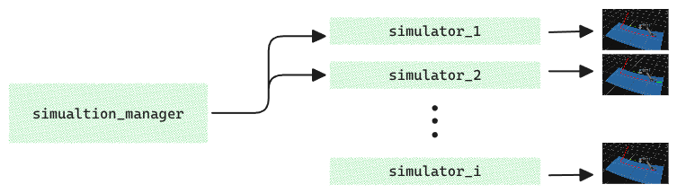

# MPC Surface Tracking

**Autumn 2025 - 062047 - NUMERICAL OPTIMIZATION FOR CONTROL**


> **Abstract**
>
> This project implements Model Predictive Control (MPC) algorithms for surface tracking.
> Offers a framework for doing gridseaches, sweeps and induvidual simulations
> using CasADi and acados frameworks.


## How to



## Usage
Take a look at the examples notebook's, make sure to change the path in the 1st cell.

### Running a Grid Search

```python
from simulator import SimulationManager
import numpy as np

# Base configuration for all simulations
BASE_PARAMS = {
    'robot_name': 'ur10',
    'dt': 0.01,
    'simulation_time': 6,
    'prediction_horizon': 100,
    'surface_limits': ((-2, 2), (-2, 2)),
    'surface_origin': np.array([0.0, 0.0, 0.0]),
    'surface_orientation_rpy': np.array([0.0, 0.0, 0.0]),
    'q_0': np.array([np.pi/4, -np.pi/3, np.pi/4, -np.pi/2, -np.pi/2, 0.0]),
    'qdot_0': np.array([1, 2, 1, 0, 0, 0]),
    'wcv': np.array([200,200,200,200,200,200], dtype=np.float64),
    'q_min': np.array([-2*np.pi, -2*np.pi, -2*np.pi, -2*np.pi, -2*np.pi, -2*np.pi], dtype=float),
    'q_max': np.array([+2*np.pi, +2*np.pi, +2*np.pi, +2*np.pi, +2*np.pi, +2*np.pi], dtype=float),
    'qdot_min': np.array([-2.16, -2.16, -np.pi, -3.20, -3.20, -3.20], dtype=float),
    'qdot_max': np.array([2.16, 2.16, np.pi, 3.20, 3.20, 3.20], dtype=float),
    'w_qddot':0.02,
    'scene': True
    }

# Initialize manager
manager = SimulationManager(BASE_PARAMS)

# Grid search over multiple parameters
manager.grid_search({
    'prediction_horizon': [20, 30, 40],
    'w_qddot': [0.02, 0.05],
    'w_u':[0.01, 0.001],
    'solver_options': [
        {'nlp_solver_type': 'SQP', 'qp_solver': 'PARTIAL_CONDENSING_HPIPM'},
        {'nlp_solver_type': 'SQP_RTI', 'qp_solver': 'PARTIAL_CONDENSING_HPIPM'},
    ],
})

# Run all simulations
results = manager.run_all()
```

**Other options:**
```python
# Single parameter sweep
manager.sweep_parameter('prediction_horizon', [10, 50, 100, 200])

# Manual simulation
manager.add_manual(name='custom_run', params={'prediction_horizon': 300})
```

See `examples/simple_sim.ipynb` for single runs and `main.py` for full grid search with plotting.

### 3D Visuals


### Real-time feasibility of the MPC controller
Across all random surface instances, the MPC computation time consistently remains well below the sampling period, confirming suitability for real-time execution.


