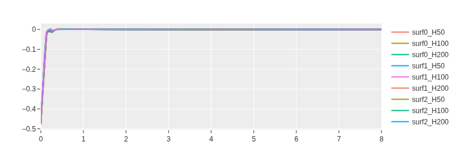
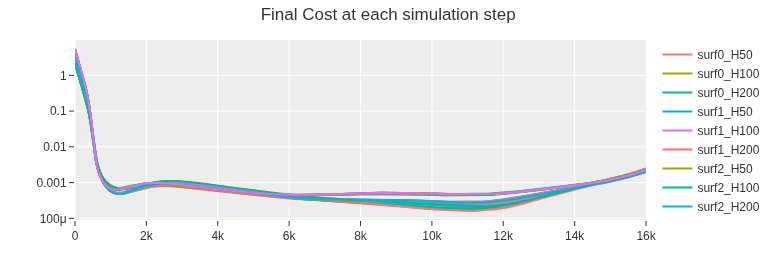

# MPC Surface Tracking

**Autumn 2025 - 062047 - NUMERICAL OPTIMIZATION FOR CONTROL**


> **Abstract**
>
> This project implements Model Predictive Control (MPC) algorithms for surface tracking.
> Offers a framework for doing gridseaches, sweeps and induvidual simulations
> using CasADi and acados frameworks.


## How to


## Usage
Take a look at the examples notebook's, make sure to change the path in the 1st cell.

### Running a Grid Search

```python
from simulator import SimulationManager
import numpy as np

# Base configuration for all simulations
BASE_PARAMS = {
    'dt': 0.0005,
    'simulation_time': 8,
    'q_0': np.array([np.pi/3, -np.pi/3, np.pi/4, -np.pi/2, -np.pi/2, 0.0]),
    'prediction_horizon': 200,
}

# Initialize manager
manager = SimulationManager(BASE_PARAMS)

# Grid search over multiple parameters
manager.grid_search({
    'prediction_horizon': [50, 100, 200],
    'dt': [0.0005, 0.001],
    'solver_options': [
        {'nlp_solver_type': 'SQP', 'qp_solver': 'PARTIAL_CONDENSING_HPIPM'},
        {'nlp_solver_type': 'SQP_RTI', 'qp_solver': 'PARTIAL_CONDENSING_HPIPM'},
    ],
})

# Run all simulations
results = manager.run_all()
```

**Other options:**
```python
# Single parameter sweep
manager.sweep_parameter('prediction_horizon', [10, 50, 100, 200])

# Manual simulation
manager.add_manual(name='custom_run', params={'prediction_horizon': 300})
```

See `examples/simple_sim.ipynb` for single runs and `main.py` for full grid search with plotting.

### 3D Visuals


### Plotting & Benchmarks



